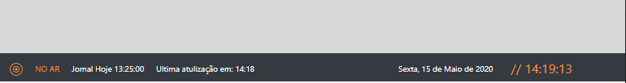
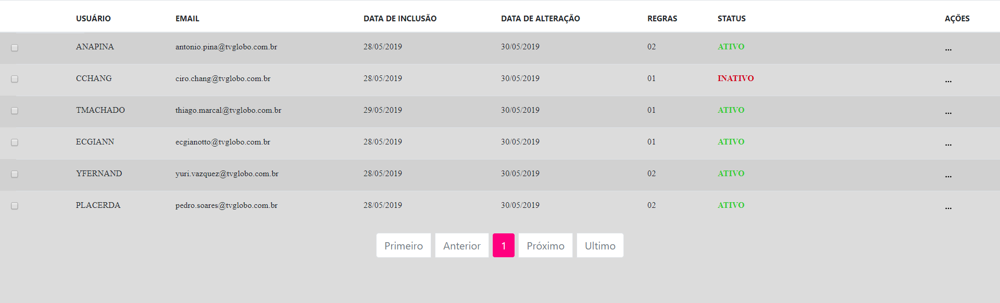
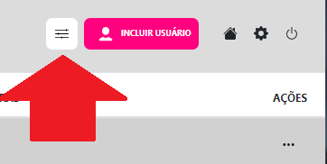
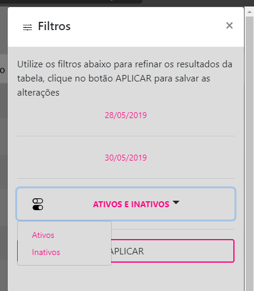
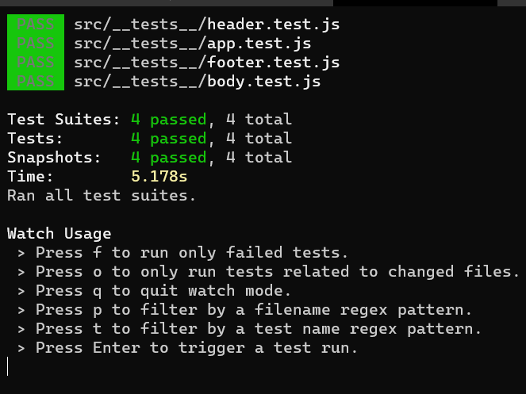

# Globo Full Stack

## Back

Use Python 3.7 or higher to run the code

### Question: 1

One (array, target) must be used to call the target function.
I included an error if it was impossible to reach the target with the sum and 2 elements of the array.
the function allows 2 equal numbers to be used, but each element of the array will be used only once.
if you do not want to repeat 2 real numbers, target function 2 has been created.

Errors:

Error-01 - a target number was inserted whose sum of two
elements other than Array x cannot be met.

### Question: 2

When calling the balancing function with a string, the return will be answered if it is balanced 'yes' or 'no'.

### Question: 3

When calling the balancing function with a string, the return will be answered, maximum profit, the day to buy, the day to sell and the purchase and sale value.

### Question: 4

When calling the water volume function you will receive the water volume from the graph

## Front

Start by globally installing JSON SERVER `npm install -g json-server` , it will serve as a complete testing API for application development.
Open the db folder in our application on your terminal and run the command `json-server DB.json` so that we have our test api working with the necessary data for the application to work.

If you want to perform a CRUD use Postman or another API testing service there you can have a more refined control of these changes that will be reflected in the application after updating the page.

After the testing API is running you can enter the link:
<a href="https://globo-teste-fullstack.herokuapp.com/">Globo Frontend</a>
 , where you will see the application working. The expected responses from the page follow below...

### Footer

The footer will dynamically display Globo's programming, the schedule grid of May 12, 2020 was used as an example. Every 10 minutes the information will be updated.

### Users

The user list will be displayed by default as shown below

### Header

You must click on the filters in order to use the functionality requested in the challenge.

### Filters

The filters will work 100% and must be filled in this way.

After filling, you must click on apply to perform the filter on the user list.

## React Pattern

Tests on components

